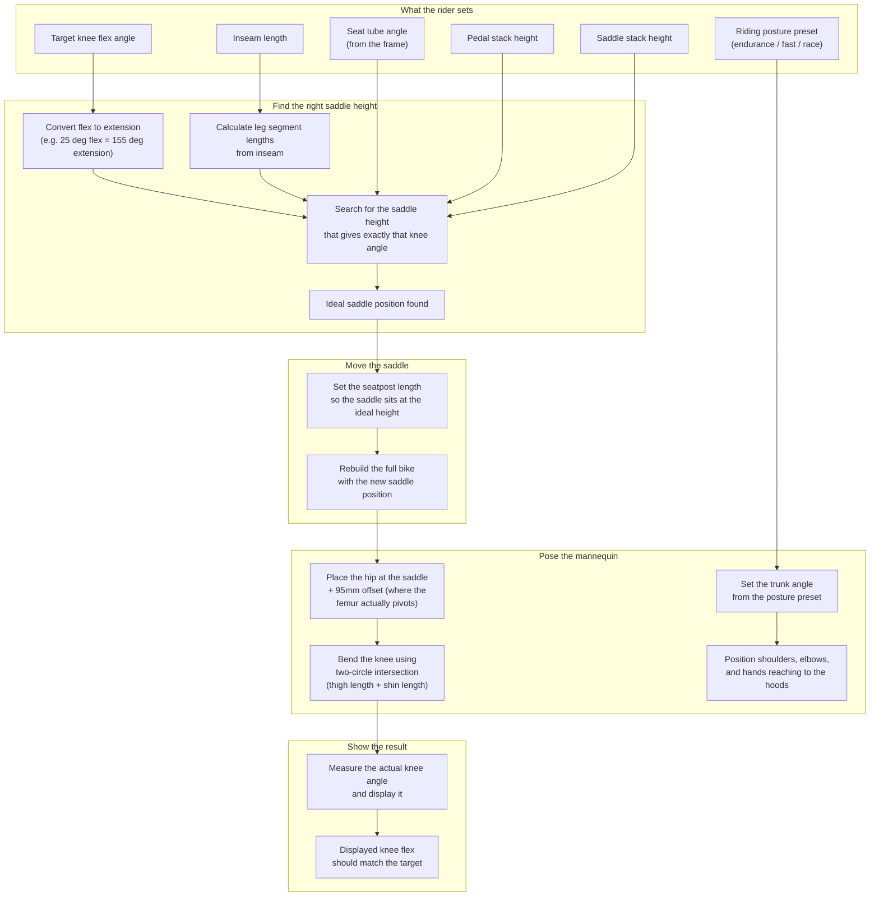
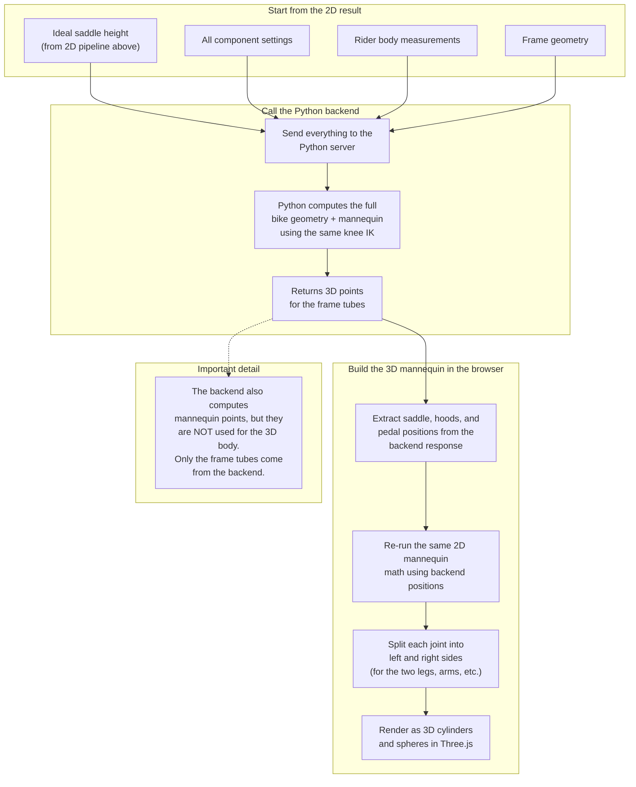

# How Knee Flex Works

The rider's knee bend is controlled by two pipelines — one for the **2D side view** (runs entirely in the browser) and one for the **3D view** (calls the Python backend). Both should produce the same knee position.

---

## 2D Side View Pipeline

### How the knee search works

The system uses a **bisection search** — it tries different saddle heights, each time:
1. Placing the hip joint 95mm above the trial saddle position
2. Solving where the knee must be (given thigh and shin lengths reaching to the ankle)
3. Measuring the resulting angle
4. Adjusting the saddle up or down until the angle matches the target

This runs 50 iterations and converges to sub-millimeter precision.

---

## 3D View Pipeline

### Why it re-runs the mannequin math

The 3D view rebuilds the mannequin in the browser (rather than using backend points) so it can apply the **same trunk angle and back bend** settings from the posture preset. This keeps the 2D and 3D mannequins visually identical.

---

## Key files

| What | Where |
|------|-------|
| Saddle height search | `web/src/geometry.ts` — `idealContactsFromRider()` |
| Auto-seatpost adjustment | `web/src/FitBuilderMode.tsx` — useEffect near line 297 |
| Bike geometry from components | `web/src/geometry.ts` — `synthesizeBike()` |
| Mannequin posing (2D) | `web/src/geometry.ts` — `buildMannequin()` |
| Knee angle measurement | `web/src/geometry.ts` — `angleAtPoint()` |
| 3D mannequin expansion | `web/src/geometry.ts` — `buildMannequin3DPoints()` |
| 3D rendering | `web/src/BikeScene3D.tsx` |
| Backend mannequin solver | `bikegeo_core/mannequin2d.py` |
| Backend 3D expansion | `bikegeo_core/mannequin3d.py` |

---

## The rule both pipelines must follow

The femur pivots at the **hip joint center**, which is ~95mm above the saddle surface (where the sit bones rest). Every calculation that positions the knee — whether it's the saddle height search, the mannequin IK, or the angle measurement — must use this hip joint position, not the saddle surface.
