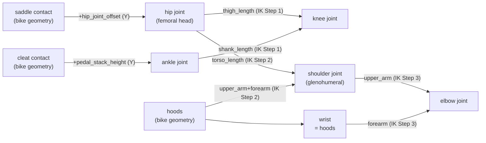
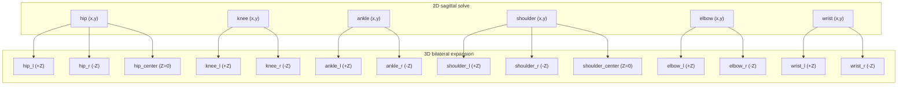

# Mannequin Construction

Describes how the 2D sagittal-plane skeleton and its 3D bilateral expansion are built from rider anthropometrics and bike contact points.

---

## Anthropometric inputs (`RiderAnthropometrics`)

| Field | Meaning |
|---|---|
| `thigh_length` | Femoral head → knee joint centre |
| `shank_length` | Knee joint centre → ankle joint centre |
| `torso_length` | **Femoral head → glenohumeral joint centre** (hip-to-shoulder, joint-to-joint; _not_ hip bone to base of neck) |
| `upper_arm_length` | Glenohumeral → elbow joint centre |
| `forearm_length` | Elbow joint centre → wrist |
| `foot_length` | Not used in current IK chain |
| `shoulder_width` | Bilateral shoulder spread (centre-to-centre) in mm |
| `hip_width` | Bilateral hip spread; defaults to 200 mm if absent |
| `hip_joint_offset` | Vertical rise from saddle contact surface to femoral head (default 95 mm) |

---

## 2D Pose Solver (`mannequin2d.py · solve_pose_2d_full`)

All coordinates live in the sagittal plane (X = forward, Y = up, origin = bottom bracket).

### Anchor points (from bike geometry)

```
saddle contact  →  hip joint     : hip.y = saddle.y + hip_joint_offset
cleat contact   →  ankle joint   : ankle.y = cleat.y + pedal_stack_height
hoods                             : wrist = hoods (hands pin to hoods)
```

### IK chains

```
Step 1  Knee
        Circle(hip, thigh_length) ∩ Circle(ankle, shank_length)
        → prefer_upper=True  (knee rises above hip–ankle line)

Step 2  Shoulder
        Circle(hip, torso_length) ∩ Circle(hoods, upper_arm + forearm − 0.1 mm)
        → prefer_upper=True  (shoulder sits above hip)
        The 0.1 mm trim keeps the inner elbow IK non-degenerate.

Step 3  Elbow
        Circle(shoulder, upper_arm) ∩ Circle(wrist, forearm)
        → prefer_upper=False  (elbow drops below shoulder–wrist line)
```

### Derived angles

| Metric | Definition |
|---|---|
| `trunk_angle_deg` | `atan2(shoulder.y − hip.y, shoulder.x − hip.x)` — angle of torso vector from horizontal |
| `hip_angle_deg` | Interior angle at hip: shoulder → hip → knee |
| `shoulder_flexion_deg` | Interior angle at shoulder: hip → shoulder → elbow |
| `elbow_flexion_deg` | `180° − interior_angle(shoulder, elbow, wrist)` |
| `knee_extension_deg` | Interior angle at knee: hip → knee → ankle |

### 2D joint graph



---

## 3D Pose Solver (`mannequin3d.py · solve_pose_3d`)

The 3D solver runs the 2D solver first, then expands the sagittal joints into bilateral (±Z) pairs using widths sourced from rider/component data.

### Z-spread rules

| Joint(s) | Z half-spread | Source |
|---|---|---|
| Cleat / ankle / knee | `stance_width / 2` | `components.stance_width` or 155 mm default |
| Hip | `hip_width / 2` | `rider.hip_width` or 200 mm default |
| Shoulder / elbow | `shoulder_width / 2` | `rider.shoulder_width` |
| Wrist | `hood_width / 2` | `components.hood_width` or `bar_width` |

All bilateral points carry the same XY position as their 2D counterpart; only Z differs.

### 3D mannequin point set

```
hip_center, hip_l, hip_r
shoulder_center, shoulder_l, shoulder_r
knee_l, knee_r
ankle_l, ankle_r
elbow_l, elbow_r
wrist_l, wrist_r
cleat_l, cleat_r
```

### 3D edge groups and tube radii

| Edge group | Edges | Render radius |
|---|---|---|
| `mannequin_leg` | cleat→ankle, ankle→knee, knee→hip (×2), hip_l→hip_r | 55 mm |
| `mannequin_torso` | hip_center→shoulder_center | 80 mm |
| `mannequin_arm` | shoulder→elbow, elbow→wrist (×2), shoulder_l→shoulder_r | 35 mm |

### 3D construction graph



---

## Posture constraints (`constraints.py`)

The solver checks each pose metric against the active `PosePreset` angle bands:

| Constraint | Pose metric checked |
|---|---|
| `trunk_angle` | `trunk_angle_deg` |
| `hip_angle` | `hip_angle_deg` |
| `shoulder_flexion` | `shoulder_flexion_deg` |
| `elbow_flexion` | `elbow_flexion_deg` |
| `knee_extension` | `knee_extension_deg` |

Out-of-band values produce `ConstraintViolation` entries; the overall status becomes `FEASIBLE_WITH_COMPROMISES`.

---

## Rendering pipeline summary

### Frame structural points used by `geometry_export.py`

| Point | Definition |
|---|---|
| `seat_cluster` | Seat-tube / top-tube / seatstay junction. When `top_tube_effective` is available, this sits on the seat-tube axis at `x = reach - top_tube_effective`, rather than at the full seat-tube top. |
| `seat_tube_top` | Full seat-tube / seat-mast top from `seat_tube_ct` (or the legacy stack-based fallback). This is the anchor for the rendered seatpost / mast extension, not the top-tube junction. |
| `seatpost_top` | Visual top of the rendered seatpost / topper, extending a short fixed distance above `saddle_clamp` so the exposed post is not truncated at the clamp centre. |
| `head_tube_top` | `(reach, stack)`; top of the head tube on the frame centreline. |
| `head_tube_bottom` | Derived from `head_tube` along the head axis when catalog length is available; otherwise back-solved from front axle + fork geometry. |

```mermaid
flowchart LR
    A["RiderAnthropometrics\n+ BikePoints"] --> B["solve_pose_2d_full\n(mannequin2d.py)"]
    B --> C["PoseMetrics\n+ MannequinJoints2D"]
    C --> D["solve_pose_3d\n(mannequin3d.py)"]
    D --> E["pts_3d dict\n(bilateral joints)"]
    E --> F["build_export\n(geometry_export.py:\nseat_cluster + true head_tube_bottom)"]
    F --> G["Geometry3DResponse\n(points + edges)"]

    G --> H["BikeScene3D.tsx"]

    G -->|"bike contact points\n(saddle, hoods, cleat)"| J["buildMannequin\n(geometry.ts)\nFK with targetTrunkAngle"]
    J --> K["buildMannequin3DPoints\n(geometry.ts)\nbilateral expansion"]
    K -->|"mannequin3DOverride"| H

    H -->|"replace backend\nmannequin edges"| L["R3F cylinders\n(merged scene)"]

    C -.->|"2D overlay"| I["Overlay2D\n(green cylinders, z=0)"]
```



---

## Frontend bilateral expansion (visualization override)

For visualization, the frontend builds its own 3D mannequin using `buildMannequin3DPoints()` in `geometry.ts`, rather than directly using the backend's IK-derived mannequin.

**Why:** The frontend uses the user's target trunk angle (forward kinematics via the trunk angle slider) to position the shoulder, whereas the backend's `solve_pose_2d_full()` uses inverse kinematics from saddle→hoods. This ensures the 3D rendered mannequin honors the user's trunk angle preference.

**How it works:**

1. The backend `Geometry3DResponse` provides bike contact points (saddle, hoods, cleat) that anchor the mannequin to the 3D frame.
2. `buildMannequin()` (geometry.ts) runs forward kinematics from the hip joint using `targetTrunkAngleDeg` to place the shoulder, then solves elbow position via circle–circle intersection.
3. `buildMannequin3DPoints()` expands the 2D sagittal-plane mannequin into bilateral 3D using the same Z-spread rules and point/edge names as the backend (`mannequin3d.py` / `geometry_export.py`).
4. `BikeScene3D` merges the frontend mannequin with the backend frame geometry by filtering out `mannequin*` edge groups from the backend response and replacing them with the frontend-generated mannequin edges. The backend frame payload now distinguishes the seat cluster from the full seat-tube top, so sloping top tubes and integrated seat masts do not collapse into one point.

**Contract:** The frontend bilateral expansion must produce the same point names, edge definitions, and Z-spread rules as the backend. This is enforced by regression tests in `tests/test_bilateral_expansion.py`.
