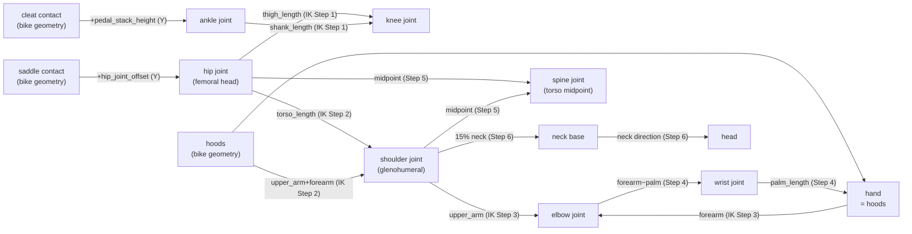

# Mannequin Construction

Describes how the 2D sagittal-plane skeleton and its 3D bilateral expansion are built from rider anthropometrics and bike contact points.

---

## Anthropometric inputs (`RiderAnthropometrics`)

| Field | Meaning |
|---|---|
| `thigh_length` | Femoral head → knee joint centre |
| `shank_length` | Knee joint centre → ankle joint centre |
| `torso_length` | **Femoral head → glenohumeral joint centre** (hip-to-shoulder, joint-to-joint; _not_ hip bone to base of neck) |
| `upper_arm_length` | Glenohumeral → elbow joint centre |
| `forearm_length` | Elbow joint centre → hand (hoods contact) |
| `foot_length` | Shoe/foot length; used for visual rendering |
| `shoulder_width` | Bilateral shoulder spread (centre-to-centre) in mm |
| `hip_width` | Bilateral hip spread; defaults to 200 mm if absent |
| `hip_joint_offset` | Vertical rise from saddle contact surface to femoral head (default 95 mm) |
| `weight_kg` | Rider weight in kg; drives anatomical scaling of mannequin radii (default 75 kg) |

---

## 2D Pose Solver (`mannequin2d.py · solve_pose_2d_full`)

All coordinates live in the sagittal plane (X = forward, Y = up, origin = bottom bracket).

### Anchor points (from bike geometry)

```
saddle contact  →  hip joint     : hip.y = saddle.y + hip_joint_offset
cleat contact   →  ankle joint   : ankle.y = cleat.y + pedal_stack_height
hoods                             : hand = hoods (hands pin to hoods)
```

### IK chains

```
Step 1  Knee
        Circle(hip, thigh_length) ∩ Circle(ankle, shank_length)
        → prefer_upper=True  (knee rises above hip–ankle line)

Step 2  Shoulder
        Circle(hip, torso_length) ∩ Circle(hoods, upper_arm + forearm − 0.1 mm)
        → prefer_upper=True  (shoulder sits above hip)
        The 0.1 mm trim keeps the inner elbow IK non-degenerate.

Step 3  Elbow
        Circle(shoulder, hand, upper_arm, forearm)
        → prefer_upper=False  (elbow drops below shoulder–hand line)

Step 4  Wrist
        Along elbow→hand vector at (forearm − palm_length) from elbow.
        palm_length = 0.055 × height (~100 mm for 1800 mm rider).

Step 5  Spine joint
        Midpoint of hip and shoulder (splits torso into upper/lower).

Step 6  Head & neck base
        neckAngle = 55° − 0.6 × trunk_angle
        headDir = trunk_angle + neckAngle
        neckLength = 185 × (height / 1800)
        head = shoulder + neckLength × headDir
        neck_base = shoulder + 0.15 × (head − shoulder)
```

### Derived angles

| Metric | Definition |
|---|---|
| `trunk_angle_deg` | `atan2(shoulder.y − hip.y, shoulder.x − hip.x)` — angle of torso vector from horizontal |
| `hip_angle_deg` | Interior angle at hip: shoulder → hip → knee |
| `shoulder_flexion_deg` | Interior angle at shoulder: hip → shoulder → elbow |
| `elbow_flexion_deg` | `180° − interior_angle(shoulder, elbow, hand)` |
| `knee_extension_deg` | Interior angle at knee: hip → knee → ankle |

### 2D joint graph


```mermaid
graph LR
    saddle["saddle contact\n(bike geometry)"]
    cleat["cleat contact\n(bike geometry)"]
    hoods["hoods\n(bike geometry)"]

    hip["hip joint\n(femoral head)"]
    knee["knee joint"]
    ankle["ankle joint"]
    shoulder["shoulder joint\n(glenohumeral)"]
    elbow["elbow joint"]
    wrist["wrist joint"]
    hand["hand\n= hoods"]
    spine["spine joint\n(torso midpoint)"]
    neckBase["neck base"]
    head["head"]

    saddle -- "+hip_joint_offset (Y)" --> hip
    cleat -- "+pedal_stack_height (Y)" --> ankle
    hoods --> hand

    hip -- "thigh_length (IK Step 1)" --> knee
    ankle -- "shank_length (IK Step 1)" --> knee

    hip -- "torso_length (IK Step 2)" --> shoulder
    hoods -- "upper_arm+forearm (IK Step 2)" --> shoulder

    shoulder -- "upper_arm (IK Step 3)" --> elbow
    hand -- "forearm (IK Step 3)" --> elbow
    elbow -- "forearm−palm (Step 4)" --> wrist
    wrist -- "palm_length (Step 4)" --> hand

    hip -- "midpoint (Step 5)" --> spine
    shoulder -- "midpoint (Step 5)" --> spine

    shoulder -- "15% neck (Step 6)" --> neckBase
    neckBase -- "neck direction (Step 6)" --> head
```

---

## 3D Pose Solver (`mannequin3d.py · solve_pose_3d`)

The 3D solver runs the 2D solver first, then expands the sagittal joints into bilateral (±Z) pairs using widths sourced from rider/component data.

### Z-spread rules

| Joint(s) | Z half-spread | Source |
|---|---|---|
| Cleat / ankle / knee | `stance_width / 2` | `components.stance_width` or 155 mm default |
| Hip | `hip_width / 2` | `rider.hip_width` or 200 mm default |
| Shoulder / elbow | `shoulder_width / 2` | `rider.shoulder_width` |
| Wrist / hand | `hood_width / 2` | `components.hood_width` or `bar_width` |
| Spine joint / neck base / head | 0 (centerline) | — |

All bilateral points carry the same XY position as their 2D counterpart; only Z differs.

### 3D mannequin point set

```
hip_center, hip_l, hip_r
spine_joint
shoulder_center, shoulder_l, shoulder_r
neck_base_center, head_center
knee_l, knee_r
ankle_l, ankle_r
elbow_l, elbow_r
wrist_l, wrist_r
hand_l, hand_r
cleat_l, cleat_r
```

### 3D edge groups and primitives

Base radii are derived from 2D SVG stroke widths (`strokeWidth = diameter`, so `radius = strokeWidth / 2`). 2D reference at height=1800: torso 175, thigh 110, shin 82, upper arm 70, forearm 55, head 88r.

| Edge group | Edges | Primitive | Base radius |
|---|---|---|---|
| `mannequin_foot` | cleat→ankle (×2) | Tapered cylinder | 41→25 mm |
| `mannequin_shin` | ankle→knee (×2) | Cylinder | 41 mm |
| `mannequin_thigh` | knee→hip (×2) | Cylinder | 55 mm |
| `mannequin_hip_bar` | hip_l→hip_r | Cylinder | 65 mm |
| `mannequin_lower_torso` | hip_center→spine_joint | Cylinder | 80 mm |
| `mannequin_upper_torso` | spine_joint→shoulder_center | Cylinder | 88 mm |
| `mannequin_neck` | neck_base_center→head_center | Cylinder | 28 mm |
| `mannequin_shoulder_bar` | shoulder_l→shoulder_r | Cylinder | 35 mm |
| `mannequin_upper_arm` | shoulder→elbow (×2) | Cylinder | 35 mm |
| `mannequin_forearm` | elbow→wrist (×2) | Cylinder | 28 mm |
| `mannequin_hand` | wrist→hand (×2) | Capsule | 23 mm |

Joint spheres are rendered at key points:

| Joint | Points | Base radius |
|---|---|---|
| Head | `head_center` | 88 mm |
| Spine | `spine_joint` | 84 mm |
| Shoulder | `shoulder_l/r` | 38 mm |
| Elbow | `elbow_l/r` | 35 mm |
| Wrist | `wrist_l/r` | 26 mm |
| Hip | `hip_l/r` | 58 mm |
| Knee | `knee_l/r` | 55 mm |
| Ankle | `ankle_l/r` | 41 mm |

---

## Weight-based anatomical radius scaling

Body part radii scale with rider weight using per-region sensitivity exponents.

**Formula:** `radius = baseRadius × (weight_kg / 75)^sensitivity`

| Region | Sensitivity | Rationale |
|---|---|---|
| Torso (upper + lower) | 0.45 | Largest fat depot — belly, chest |
| Hip bar / Hip joint | 0.40 | Hips widen significantly |
| Thigh / Knee joint | 0.35 | Major weight-bearing muscle/fat |
| Neck | 0.25 | Noticeable with weight |
| Upper arm / Shoulder / Elbow | 0.20 | Moderate fat storage |
| Shin / Ankle | 0.15 | Lean, mostly bone/tendon |
| Forearm / Wrist | 0.10 | Lean region |
| Foot | 0.10 | Minimal change |
| Head / Hand | 0.05 | Nearly constant |

**Examples (upper torso base=88, thigh base=55, forearm base=28):**
- 90 kg rider (w=1.2): upper torso 95 mm (+8%), thigh 58 mm (+6%), forearm 28.5 mm (+2%)
- 60 kg rider (w=0.8): upper torso 81 mm (-8%), thigh 52 mm (-6%)

---

## Visual style

| Property | Value |
|---|---|
| Shading | Toon/cel-shaded (`MeshToonMaterial` with 3-step gradient) |
| Outline | Inverted-hull technique (back-face black mesh, scale 1.03×) |
| Opacity | 0.4 (semi-transparent) |
| Color | `#c8a87a` (warm tan) |

---

## Rendering pipeline summary

### Frame structural points used by `geometry_export.py`

| Point | Definition |
|---|---|
| `seat_cluster` | Seat-tube / top-tube / seatstay junction. When `top_tube_effective` is available, this sits on the seat-tube axis at `x = reach - top_tube_effective`, rather than at the full seat-tube top. |
| `seat_tube_top` | Full seat-tube / seat-mast top from `seat_tube_ct` (or the legacy stack-based fallback). This is the anchor for the rendered seatpost / mast extension, not the top-tube junction. |
| `seatpost_top` | Visual top of the rendered seatpost / topper, extending a short fixed distance above `saddle_clamp` so the exposed post is not truncated at the clamp centre. |
| `head_tube_top` | `(reach, stack)`; top of the head tube on the frame centreline. |
| `head_tube_bottom` | Derived from `head_tube` along the head axis when catalog length is available; otherwise back-solved from front axle + fork geometry. |


```mermaid
flowchart LR
    A["RiderAnthropometrics\n+ BikePoints"] --> B["solve_pose_2d_full\n(mannequin2d.py)"]
    B --> C["PoseMetrics\n+ MannequinJoints2D\n(10 joints)"]
    C --> D["solve_pose_3d\n(mannequin3d.py)"]
    D --> E["pts_3d dict\n(bilateral joints\n+ head/neck/spine)"]
    E --> F["build_export\n(geometry_export.py:\n11 granular edge groups)"]
    F --> G["Geometry3DResponse\n(points + edges)"]

    G --> H["BikeScene3D.tsx"]

    G -->|"bike contact points\n(saddle, hoods, cleat)"| J["buildMannequin\n(geometry.ts)\nFK with targetTrunkAngle"]
    J --> K["buildMannequin3DPoints\n(geometry.ts)\nbilateral expansion"]
    K -->|"mannequin3DOverride"| H

    H -->|"frame: buildTubes\nmannequin: buildMannequinParts\n(weight-scaled radii)"| L["R3F scene\n(spheres, cylinders,\ncapsules, tapered cyl)"]

    C -.->|"2D overlay"| I["Overlay2D\n(green cylinders, z=0)"]
```

---

## Frontend bilateral expansion (visualization override)

For visualization, the frontend builds its own 3D mannequin using `buildMannequin3DPoints()` in `geometry.ts`, rather than directly using the backend's IK-derived mannequin.

**Why:** The frontend uses the user's target trunk angle (forward kinematics via the trunk angle slider) to position the shoulder, whereas the backend's `solve_pose_2d_full()` uses inverse kinematics from saddle→hoods. This ensures the 3D rendered mannequin honors the user's trunk angle preference.

**How it works:**

1. The backend `Geometry3DResponse` provides bike contact points (saddle, hoods, cleat) that anchor the mannequin to the 3D frame.
2. `buildMannequin()` (geometry.ts) runs forward kinematics from the hip joint using `targetTrunkAngleDeg` to place the shoulder, then solves elbow position via circle-circle intersection, and computes wrist (along forearm), spine joint (torso midpoint), neck base, and head.
3. `buildMannequin3DPoints()` expands the 2D sagittal-plane mannequin into bilateral 3D using the same Z-spread rules and point/edge names as the backend (`mannequin3d.py` / `geometry_export.py`).
4. `BikeScene3D` merges the frontend mannequin with the backend frame geometry. Frame edges go through `buildTubes()` (unchanged cylinders). Mannequin edges go through `buildMannequinParts()` which produces distinct primitives (spheres, cylinders, capsules, tapered cylinders) with weight-scaled radii.

**Contract:** The frontend bilateral expansion must produce the same point names, edge definitions, and Z-spread rules as the backend. This is enforced by regression tests in `tests/test_bilateral_expansion.py`.

---

## Skeleton hierarchy (procedural rider specification)

The mannequin follows an articulated skeleton with distinct primitives per body part:

```
Head (sphere) ← Neck (cylinder) ← Upper Torso (cylinder) ← Spine Joint (sphere)
  ← Lower Torso (cylinder) ← Hip Joint (sphere)

Shoulder Joint (sphere) ← Upper Arm (cylinder) ← Elbow Joint (sphere)
  ← Forearm (cylinder) ← Wrist Joint (sphere) ← Hand (capsule)

Hip Joint (sphere) ← Thigh (cylinder) ← Knee Joint (sphere)
  ← Shin (cylinder) ← Ankle Joint (sphere) ← Foot (tapered cylinder)
```
